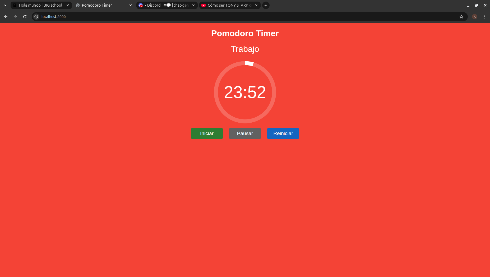

# Pomodoro App

## 📖 Introducción
Pomodoro App es una aplicación sencilla que implementa la técnica de productividad **Pomodoro**.  
La técnica consiste en dividir el tiempo de trabajo en intervalos (generalmente de 25 minutos) separados por descansos cortos, y cada cierto número de ciclos, un descanso más largo.  

Su finalidad es ayudarte a mantener la concentración, evitar la fatiga mental y mejorar la gestión del tiempo en tus tareas diarias.

---

## 🎯 Finalidad y Usos
- **Productividad personal**: mantener el foco en tareas importantes.  
- **Estudio**: organizar sesiones de aprendizaje con pausas regulares.  
- **Trabajo en equipo**: sincronizar ciclos de trabajo y descanso.  
- **Bienestar**: prevenir el agotamiento y mejorar la eficiencia.

---

## ⚙️ Instalación y Ejecución
Para iniciar la aplicación, sigue estos pasos desde una terminal **bash**:

1. Ejecuta el script de instalación:
   ```bash
   ./install.sh
2. Luego inicia la aplicación:
   ```bash
   ./start.sh
3. Abre tu navegador y accede a:
   http://localhost:8000

Allí se servirá la interfaz web del temporizador Pomodoro.

## 🖼️ Vista previa de la aplicación


